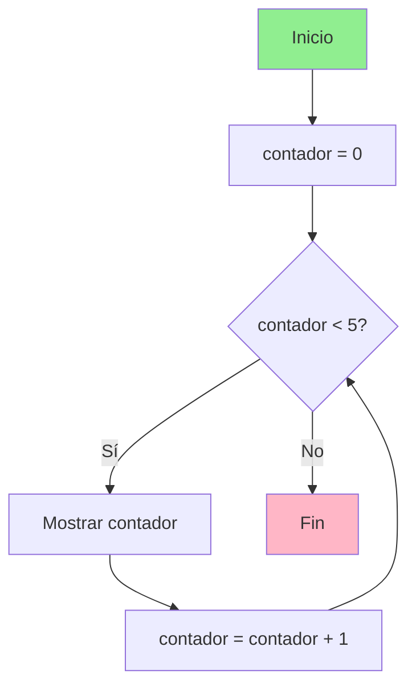
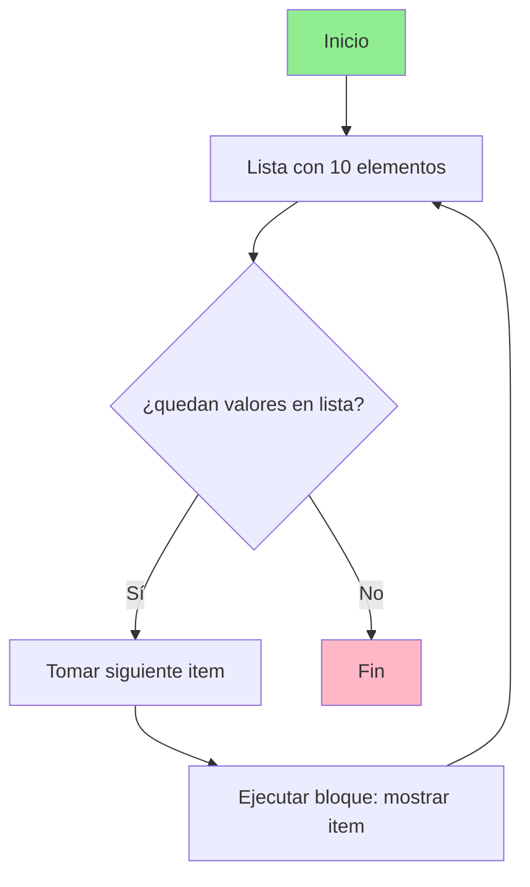

# Python
## 1. Condicionales
Un condicional es una estructura de control que permite que el programa tome decisiones en funcion si  una o varias condiciones se cumplen( es decir, si no True o False).En Python, estos bloque de codigo deben ir siempre indentados(con sangria), ya que python usa la indentacion para saber cuando empieza y termina un bloque, puedes usar 2 o 4 espacions, pero tiene que ser consistente en  todo el codigo, si eliges 2 todo el codigo a 2 y si eliges 4 pues todo a 4. Ademas, cada condicion debe de llevar dos puntos (:) al final de la linea. son utiles porque permite que un programa tome decisiones y se adapte a las distintas  situaciones. Sirven para controlar el flujo de ejecucion, validar datos, personalizar la respuesta del programa segun diferentes escenarios y reducir codigo repetitivo.

### &#8226; IF

La forma mas basica de un condicional es el if, que ejecuta un bloque de codigo solo cuando la condicion que evalua es verdadera (True). 
Su sintaxis es: 
```
if condicion:
    accion
```
Si la condicion se cumple (devuelve True) la accion se ejecuta si por el contrario devuelve (false) la accion no se ejecuta.

Ejemplo
```Python
lenguaje = "Python"

if lenguaje == "Python":
    print("Estás aprendiendo un lenguaje muy versátil")
```

### &#8226; ELIF
Permite evaluar multiples  condiciones sin repetir if. Es una mezcla de else e if y se utiliza par comprobar condiciones cuando la condicion if no se cumple. Las condiciones se evualuan en orden, de arriba a abajo, y en cuanto una es verdadera(True), se ejecuta el bloque de codigo y se deja de evaluar el resto. 

Su sintaxis es:
```
if condicion1:
    accion1
elif condicion2:
    accion2
```
Ejemplo:

```Python
lenguaje = "JavaScript"

if lenguaje == "Python":
    print("Backend, IA, automatización")
elif lenguaje == "JavaScript":
    print("Frontend y web")
```
El codigo se evalua de arriba abajo y en cuanto encuentra una condicion verdadera ejecuta el bloque y deja de evaluar el resto en esta caso la concidion verdadera la encuentra en elif asi que ejecuta ese codigo.

### &#8226; ELSE
Se ejecuta cuando ninguna condicion anterior es verdadera. Siempre debe de ir acompañado de un if, y opcionalmente puede haber elif. Se utiliza como caso por defecto, es decir, para ejecutar un bloque de codigo  cuando no se cumplen ninguna de las anteriores. A diferencia de if y elif, else no lleva condicion.

Su sintaxis es:
```
# sintaxis basica
if condicion:
    accion
else:
    accion_alternativa

# sintaxis con elif
if condicion:
    accion
elif condicion:
    accion
else:
    accion_alternativa

```
Ejemplo
```Python
lenguaje = "C++"

if lenguaje == "Python":
    print("Muy usado en automatización")
elif lenguaje == "JavaScript":
    print("Muy usado en web")
else:
    print("Lenguaje no reconocido en esta lista")
```
En este caso como no se cumplen ninguna de las condiciones se ejecuta el codigo de else.


## 2. Bucles

Un bucle es una estructura de control que permite ejecutar un bloque de codigo repetidamente mientras se cumpla una condición o mientras existan elementos en un coleccion.

Se usan para automatizar tareas repetitivas, evitardo tener que escribir el mismo codigo muchas veces.

Los bucles permiten recorrer colecciones de datos, repetir calculos, procesar informacion elemento a elemento y ejecutar codigo hasta que ocurra una condicion especifica.

Los bucles son utiles porque permiten que un programa repita automaticamente un bloque de codigo varias veces, evitando tener que escribirlo una y otra vez. Lo que hace que los programas sean mas flexible, eficientes y escalables.

Hay dos tipos de bucles:

while
for ... in
### &#8226; While
Ejecuta un bloque de codigo mientra una condicion logica sea verdadera.
El programa evalua la condicion antes de cada iteracion y si la condicion es verdadera, el codigo se ejecuta, si es falsa el bucle termina.
While no tiene  un numero de iteraciones definido, por lo que podria ejecutarse indefinidamente si no se establece una condicion de parada llamado valor centinela.

Diagrama de flujo de while: 

Si la condicion es verdadera(si), se ejecuta el bloque y luego vuelve a comprobar.
Si la condicion es falsa (no), se sale del bucle y termina
Por ello es necesario actualizar la condicion dentro del bucle, de lo contrario se puede crear un bucle infinito.

```Python
lenguajes = ["Python", "JavaScript", "Java", "C++", 'Ruby']
i = 0

while i < len(lenguajes):
    print(lenguajes[i])
    i+=1

```

### For...in

Se utiliza para recorrer  los elementos de una coleccion o iterable ejecutando un bloque de codigo para cada elemento.

For .. in permite itera sobre cada elemento de una sestructura de datos, un iterable es cualquier objeto que pueda recorrerse elemento por elemento como listas, tuplas sets, diccionarios, strings, rangos.
Con for tienes un principio y un fin bien definidos.

Sintaxis:
```
colección de datos
[elemento1, elemento2, elemento3]

for elemento in colección:
    ejecutar código
```

Diagrama de flujo de for...in

For recorre una lista de 10 elementos cuando acabe de recorrer la lista saldra del bucle. 

Ejemplo con una lista de 10 elementos.
```python
lenguajes =['Python', 'JavaScript', 'Java', 'Ruby','C++', 'TypeScript', 'Go', 'Rust', 'Swift', 'PHP']

for lenguaje in lenguajes:
    print(lenguaje)
```
For se puede usar en diferentes tipos de iterables como por ejemplo range().

**range()** es un funcion integrada en python que genera una secuencia de números enteros que se utiliza para controlar cuantas veces se ejecutara un bucle. No crea una lista real de numeros sino un objeto iterable que produce numeros cuando el bucle los necesita.


**range(stop)**
Cuando le damos un solo numero es el de stop

```Python

range(5)
↓
0,1,2,3,4

#el ultimo lo excluye
```
**range(start, stop)**

Cuando le damos dos numeros el primero es por el que empieza y acaba antes del ultimo

```Python

range(1,10)
↓
1,2,3,4,5,6,7,8,9

# el ultimo lo excluye
```
**range(start, stop, step)**
Cuando le damos tres numeros empieza por el primero acaba uno antes del segundo y avanza por el tercero
El tercero le indica de cuanto en cuanto avanza los numeros
```Python

for num in range(1,10,2):
   print(num)

# empezar en 1
# terminar antes de 10
# avanzar de 2 en 2
```


## 3.Lista por compresion

Una lista por compresion (list Comprehension) es una estructura que permite crear un lista nueva aplicando una expresion a cada elemento de una secuencia.

Sintaxis
```
[expresion for elemento in iterable]
```
En donde la expresion es lo que quieres hacer con cada elemento, el elementos es la variable temporal y el iterable es sobre lo que se va a iterar(lista, string, etc)
```python

words = ["python","java","rust"]

result = [word.upper() for word in words]

print(result)
```
**Con condicionales (if)**

Permite filtrar y modificar elementos de una secuencia en una sola linea, sustituyendo la combinacion de un bucle for y una condicion if tradicional.
sintaxis
```
[expresion for elemento in iterable if condicion]

```

La expresion es la transformacion que se aplica al elemento, el elememento es la variable que representa cada valor iterable, el iterable es la coleccion que se recorre y la condicion es el criterio que determina si el elemento se incluye en la nueva lista.
```python
numbers = [1,2,3,4,5,6]

result = [number * 2 for number in numbers if number % 2 == 0]

print(result)
```
No se recomienda usarla si la logica es muy compleja ya no se veria claro que es lo tiene que hacer.

El if al final solo filtra elementos. Si se quiere modificar el valor con una condición, se utiliza if/else dentro de la expresión.

```
[expresion_true if condicion else expresion_false for elemento in iterable]

```

En este caso la expresion_true es lo que ejecuta si se cumple la condicion, la condicion evalua (verdadero o falso), expresion_false es lo que se ejecuta si no se cumple la condicion el elemento es la variable que representa el valor del iterable y el iterable la coleccion que se recorre.

```python
numbers = [1, 2, 3, 4, 5]

result = [n * 2 if n % 2 == 0 else n for n in numbers]

print(result)
```

## 4.Argumentos

Argumentos son los valores reales que se pasan a la funcion durante la llamada

Parametros son las variables definidas en la declaracion de la funcion. Actuan como contenedores que recibiran los valores cuando la funcion sea llamada.

En terminos teoricos:

El parametro pertenece a la definicion de la funcion.
El argumento pertenece a la invocacion de la funcion.

#### Asociacion entre argumentos y parametros

Este proceso puede realizarse mediante distintos mecanismos, siendo los mas comunes por posicion y por nombre.

**Por Posicion** 

Los argumentos por posicion son aquellos que se asignan a los paramentros de una funcion segun el orden en el que aparecen en la llamada.
La corrrespondencia entre argumentos y paramentros se basa exclusivamente en la posicion relativa dentro de la lista de argumentos.

Esto significa que:

- El primer argumento se a asigna al primer paramentro
- El segundo argumento al segundo parametro 
- y asi sucesivamente.

Si se altera el orden, los valores pueden asociarse a parametros incorrectos, lo que puede modificar completamente el comportamiento de la funcion. Por ello se usa cuando el numero de parametros es pequeño, el orden de los parametros es claro o cuando el significado de los valores es evidente.

En los parametros tambien podemos tener un paramentro opcional que tiene un valor asociado predeterminado de manera que la funcion puede ejecutarse aunque ese argumento no se proporcionado durante la llamada.

Se considera opcional cuando la funcion dispones de un valor previamente definido que sera utilizado automaticamente si el usuario no pasa un argumento para ese paramentro. El valor predeterminado se denomina valor por defecto.

El orden de los parametros es primero los obligatorios y luego los opcionales
```python
    def saludar(nombre, mensaje="Hola"):
        print(f"{mensaje}, {nombre}!")

    saludar('Keira')  # Hola, Keira
    saludar('Hexe','¿Como estas?') # ¿Como estas?, Hexe!
    
```

**Por nombre**
  
Los parametros por nombre (keywords arguments) permite asignar valores a los argumentos de funcion utilizando el nombre del parametro y en lugar de su posicion. Esto mejora la legibilidad, permite cambiar el orden de los argumentos y facilita la omision de parametros con valores predeterminados.

Al usar nombres el orden de los argumentos en la llamada no importa.
```python
def languages(name, age):
    print(f'El lenguaje de programacion {name} se creo en el año {age}')

languages(age=1989, name='Python')

```

Usando un asterisco * en la definicion, se fuerza a que los parametros siguientes se pasen por nombre.

```python
def languages(*, name, age):
    print(f'El lenguaje de programacion {name} se creo en el año {age}')


languages(name = 'Python', age=1989)
languages('Python', 1989) # esto da error

```
## 5. Lambda

Una funcion lambda en python es un pequeña funcion anonima de una solo linea definida sin nombre usando la palaba clave lambda en lugar de def. Son ideales para tareas temporales, simples, y se usan comunmente como argumentos en funciones de orden superior como map(), filter() o sort(). Este tipo de funciones pueden tomar cualquier numero de argumentos pero solo pueden tener una expresion. 
Su sintaxis es:
```
lambda argumentos: expresion
```
- Los argumentos son los valores que recibe la funcion.
- La Expresión es la operacion qu se ejecuta y cuyo resultado devuelve.

La lambda no necesita return, porque el resultado se devuelve automaticamente

Se utilizan principalmente cuando la funcion es corta, solo se necesita una vez y se quiere escribir el codigo de forma mas compacta.
Pero cuando la logica es más compleja, es mejor usar funciones normales con def, porque son más claras y fáciles de mantener
```python
full_name = lambda name, lastname: f'{name} {lastname}' 

print(full_name('Keira','Wolh'))
```


## 6. Pip
Es un sistema de gestion de paquetes para python. Su nombre viene de *Pip Installs Packages*.

Con pip podemos instalar, actualizar y desinstalar paquetes en python.

Permite a los desarrolladores aprovechar el trabajo de la comunidad sin tener que escribir todo desde cero.
Los paquetes que pip instala proviene de  *Python Package Index (PyPI)* tambien llamado *Cheese Shop*. 

Es un repositorio centralizado donde se publican las librerias para python, desde utilidades matematicas hasta frameworks completos.

Sintaxis:
```
pip install nombre_del_paquete
```


