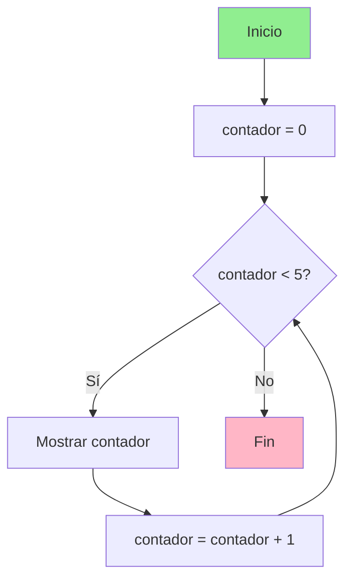
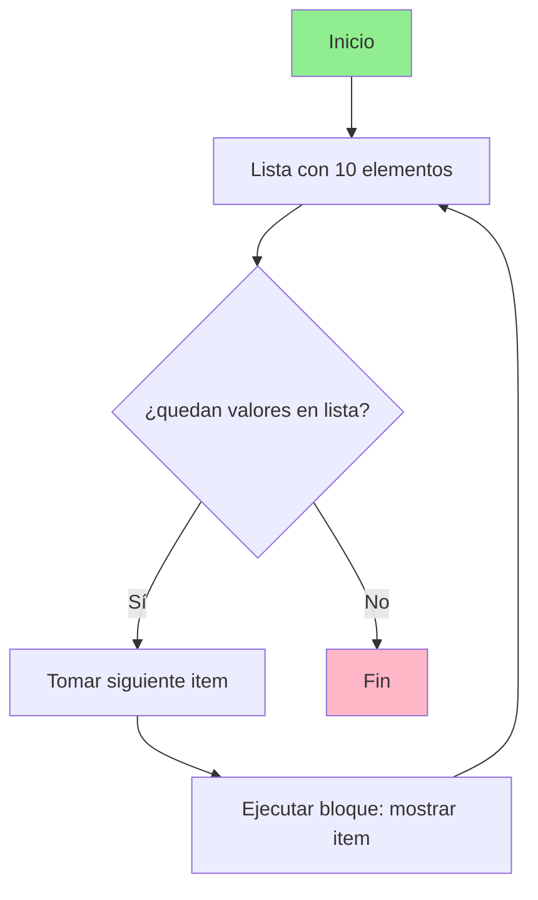

# Python
## 1. Condicionales
Un condicional es una estructura de control que permite que el programa tome decisiones en funcion si  una o varias condiciones se cumplen( es decir, si no True o False).En Python, estos bloque de codigo deben ir siempre indentados(con sangria), ya que python usa la indentacion para saber cuando empieza y termina un bloque, puedes usar 2 o 4 espacions, pero tiene que ser consistente en  todo el codigo, si eliges 2 todo el codigo a 2 y si eliges 4 pues todo a 4. Ademas, cada condicion debe de llevar dos puntos (:) al final de la linea. son utiles porque permite que un programa tome decisiones y se adapte a las distintas  situaciones. Sirven para controlar el flujo de ejecucion, validar datos, personalizar la respuesta del programa segun diferentes escenarios y reducir codigo repetitivo.

### &#8226; IF

La forma mas basica de un condicional es el if, que ejecuta un bloque de codigo solo cuando la condicion que evalua es verdadera (True). 
Su sintaxis es: 
```
if condicion:
    accion
```
Si la condicion se cumple (devuelve True) la accion se ejecuta si por el contrario devuelve (false) la accion no se ejecuta.

Ejemplo
```Python
lenguaje = "Python"

if lenguaje == "Python":
    print("Estás aprendiendo un lenguaje muy versátil")
```

### &#8226; ELIF
Permite evaluar multiples  condiciones sin repetir if. Es una mezcla de else e if y se utiliza par comprobar condiciones cuando la condicion if no se cumple. Las condiciones se evualuan en orden, de arriba a abajo, y en cuanto una es verdadera(True), se ejecuta el bloque de codigo y se deja de evaluar el resto. 

Su sintaxis es:
```
if condicion1:
    accion1
elif condicion2:
    accion2
```
Ejemplo:

```Python
lenguaje = "JavaScript"

if lenguaje == "Python":
    print("Backend, IA, automatización")
elif lenguaje == "JavaScript":
    print("Frontend y web")
```
El codigo se evalua de arriba abajo y en cuanto encuentra una condicion verdadera ejecuta el bloque y deja de evaluar el resto en esta caso la concidion verdadera la encuentra en elif asi que ejecuta ese codigo.

### &#8226; ELSE
Se ejecuta cuando ninguna condicion anterior es verdadera. Siempre debe de ir acompañado de un if, y opcionalmente puede haber elif. Se utiliza como caso por defecto, es decir, para ejecutar un bloque de codigo  cuando no se cumplen ninguna de las anteriores. A diferencia de if y elif, else no lleva condicion.

Su sintaxis es:
```
# sintaxis basica
if condicion:
    accion
else:
    accion_alternativa

# sintaxis con elif
if condicion:
    accion
elif condicion:
    accion
else:
    accion_alternativa

```
Ejemplo
```Python
lenguaje = "C++"

if lenguaje == "Python":
    print("Muy usado en automatización")
elif lenguaje == "JavaScript":
    print("Muy usado en web")
else:
    print("Lenguaje no reconocido en esta lista")
```
En este caso como no se cumplen ninguna de las condiciones se ejecuta el codigo de else.


## 2. Bucles

Un bucle es una estructura de control que permite ejecutar un bloque de codigo repetidamente mientras se cumpla una condición o mientras existan elementos en un coleccion.

Se usan para automatizar tareas repetitivas, evitardo tener que escribir el mismo codigo muchas veces.

Los bucles permiten recorrer colecciones de datos, repetir calculos, procesar informacion elemento a elemento y ejecutar codigo hasta que ocurra una condicion especifica.

Los bucles son utiles porque permiten que un programa repita automaticamente un bloque de codigo varias veces, evitando tener que escribirlo una y otra vez. Lo que hace que los programas sean mas flexible, eficientes y escalables.

Hay dos tipos de bucles:

while
for ... in
### &#8226; While
Ejecuta un bloque de codigo mientra una condicion logica sea verdadera.
El programa evalua la condicion antes de cada iteracion y si la condicion es verdadera, el codigo se ejecuta, si es falsa el bucle termina.
While no tiene  un numero de iteraciones definido, por lo que podria ejecutarse indefinidamente si no se establece una condicion de parada llamado valor centinela.

Diagrama de flujo de while: 

Si la condicion es verdadera(si), se ejecuta el bloque y luego vuelve a comprobar.
Si la condicion es falsa (no), se sale del bucle y termina
Por ello es necesario actualizar la condicion dentro del bucle, de lo contrario se puede crear un bucle infinito.

```Python
lenguajes = ["Python", "JavaScript", "Java", "C++", 'Ruby']
i = 0

while i < len(lenguajes):
    print(lenguajes[i])
    i+=1

```

### For ... in

Se utiliza para recorrer  los elementos de una coleccion o iterable ejecutando un bloque de codigo para cada elemento.

For .. in permite itera sobre cada elemento de una sestructura de datos, un iterable es cualquier objeto que pueda recorrerse elemento por elemento como listas, tuplas sets, diccionarios, strings, rangos.
Con for tienes un principio y un fin bien definidos.
Sintaxis:
```
colección de datos

[elemento1, elemento2, elemento3]

for elemento in colección:

    ejecutar código
```

Diagrama de flujo de for...in

For recorre una lista de 10 elementos cuando acabe de recorrer la lista saldra del bucle. 
Ejemplo con una lista de 10 elementos.
```python
lenguajes =['Python', 'JavaScript', 'Java', 'Ruby','C++', 'TypeScript', 'Go', 'Rust', 'Swift', 'PHP']

for lenguaje in lenguajes:
    print(lenguaje)
```

### For ... range()

range() es un funcion integrada en phython que genera un una secuencia de numero enteros que se utiliza para controlar cuantas veces se ejecutara un bucle. No crea una lista real de numeros sino un lista iterable que produce numeros cuando el bucle los necesita.


#### range(stop)
Cuando le damos un solo numero es el de stop

```Python

range(5)
↓
0,1,2,3,4

#el ultimo lo excluye
```
#### range(start, stop)

Cuando le damos dos numeros el primero es por el que empieza y acaba antes del ultimo

```Python

range(1,10)
↓
1,2,3,4,5,6,7,8,9

# el ultimo lo excluye
```
#### range(start, stop, step)
Cuando le damos tres numeros empieza por el primero acaba uno antes del segundo y avanza por el tercero
El tercero le indica de cuanto en cuanto avanza los numeros
```Python

for num in range(1,10,2):
   print(num)

# empezar en 1
# terminar antes de 10
# avanzar de 2 en 2
```

#### Break
Break es la palabra clave que permite interrumpir inmediatamente un bucle, el proposito es salir del bucle cuando se 
cumple la condicion especifica, un uso tipico es detener el bucle  al encontrar un valor buscado o evitar procesamiento adicional
cuando ya se alcanzo el objetivo.
Break detiene el bucle por completo incluso si todavia qudan elementos por iterar. 
```python
lenguajes =['Go', 'Java', 'Ruby', 'Python', 'Swift', 'PHP']
for lenguaje in lenguajes:
    if lenguaje == "Python":
        print(f"{lenguaje} fue encontrado en la posición {lenguajes.index(lenguaje)}")
        break
    print(lenguaje)
    
```
#### Continue
Continue  es una palabra clave que permite saltar la iteracion actual de un bucle y continuar con la siguiente iteracion. 
Omite ciertas iteraciones que cumplen una condicion, sin deterner el bucle completo. Se usa para saltar elementos no deseados e ignorar
casos especificos mientras se sigue procesando el resto de la secuencia.
Continue no termina el bucle, solo omite la iteracion actual.
```python
lenguajes =['Java', 'Ruby', 'Python', 'Swift', 'PHP']

for lenguaje in lenguajes:
    if lenguaje == "Python":
        print(f"No procesamos {lenguaje}, seguimos con los demás...")
        continue
    print(f"{lenguaje} será procesado normalmente")

```

